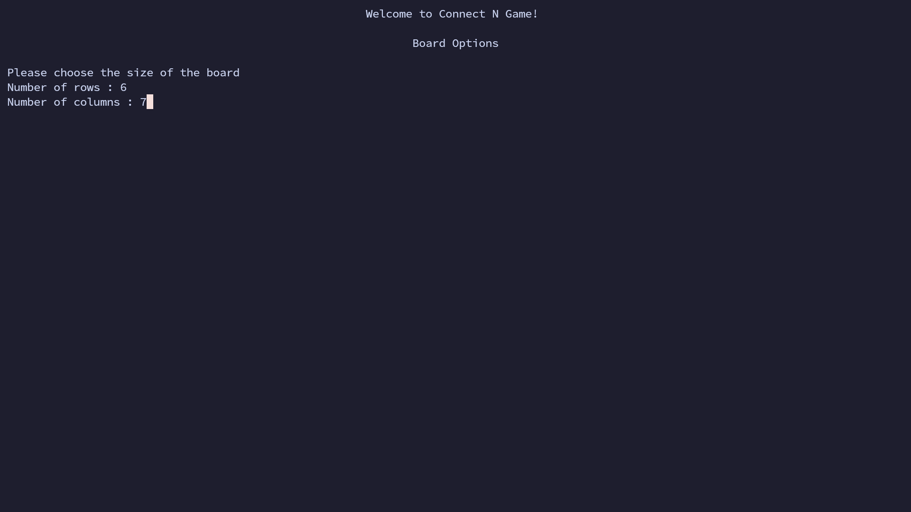

# Connect N Game

### *"Connect 4 is a game in which the players choose a color and then take turns dropping colored tokens into a six-row, seven-column vertically suspended grid. The pieces fall straight down, occupying the lowest available space within the column. The objective of the game is to be the first to form a horizontal, vertical, or diagonal line of four of one's own tokens."*

### My **Connect N** game is slightly different in which you can choose the number of rows and columns *(between 4 and 10)* and choose the number of pieces to connect *(between 3 and the maximum between rows and columns so someone can actually win)*

>Note: you need to make sure that your console supports Unicode characters like `🔵`, `🔴` and `⚪`.  
*( VS code and kitty worked with me while alacritty and Rider didn't work and idk about windows )*

### Screenshots
- board options
  

- player 1 options
  

- player 2 options
  

- game options
  

- random selection for the first move
  

- the other player move
  

- the last move *(blue will win)*
  

- blue wins!
  

